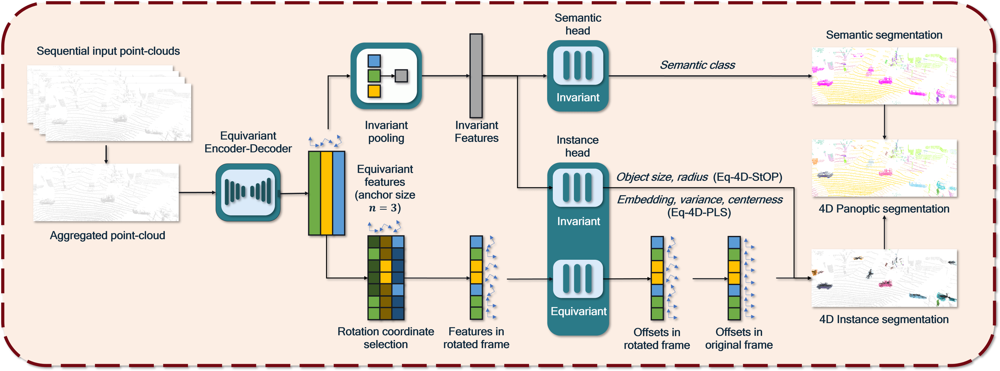

# EQ-4D-StOP

Official code for *EQ-4D-StOP* in the ICCV 2023 [paper]((https://arxiv.org/abs/2303.15651)): 

**4D Panoptic Segmentation as Invariant and Equivariant Field Prediction**. 

[Project page](https://eq-4d-panoptic.github.io/).

Our method ranks **1st** on the SemanticKITTI 4D panoptic segmentation leaderboard (among [published methods](http://semantic-kitti.org/tasks.html#panseg4d) and [all methods](https://codalab.lisn.upsaclay.fr/competitions/7097)). 



## Installation
The installation follows the [4D-StOP](https://github.com/LarsKreuzberg/4D-StOP) repository. 
```
conda create --name <env> --file requirements.txt

cd cpp_wrappers
sh compile_wrappers.sh

cd pointnet2
python setup.py install
```

## Data
### SemanticKITTI dataset
Download the SemanticKITTI dataset with labels from [here](http://semantic-kitti.org/dataset.html#download/).  
Add the `semantic-kitti.yaml` [file](https://raw.githubusercontent.com/PRBonn/semantic-kitti-api/master/config/semantic-kitti.yaml) to the folder.  
Place the dataset or a symlink to the dataset under the project root, and name it `SemanticKitti`.  
Create additional center labels: 
```
python utils/create_center_label.py
```
This step is the same as in [4D-PLS](https://github.com/mehmetaygun/4d-pls). 

### nuScenes dataset
We can also run on nuScenes dataset.  
The dataset needs to be converted into the format of SemanticKITTI using this [tool](https://github.com/minghanz/nuscenes2semantickitti), 
where the `semantic-kitti.yaml` is also included.  
Place the dataset or a symlink to the dataset under the project root, and name it `nuScenes_like_SKitti`.  
Then create additional labels with:
```
python utils/create_center_label.py --nuscene
```

Folder structure:
```
SemanticKitti/dataset/ (or nuScenes_like_SKitti/) 
└── semantic-kitti.yaml  
└── sequences/  
    └── 00/  
        └── calib.txt  
        └── poses.txt  
        └── times.txt  
        └── labels  
            ├── 000000.label  
            ├── 000000.center.npy  
            ...  
         └── velodyne  
            ├── 000000.bin  
            ...
```

## Path configuration
Under the root path of this project, the following folders will be generated to store the output:
- `results`: the training logs and checkpoints;
- `test`: inference and evaluation results;
- `runs`: tensorboard logs. 

To avoid reconfiguring the paths across different devices, one may create symbolic links from the above folders to the actual paths of dataset, checkpoints, etc. 

## Training
Use `train_SemanticKitti.py` for training. We train most of our models on a single NVIDIA A40 (48GB) GPU. The training is composed of two stages. 

1. In the first stage of training, run 
```
python -u train_SemanticKitti.py --eq
```
2. In the second stage, specify the log directory of the first-stage training in the `results` folder and run
```
python -u train_SemanticKitti.py --eq -l Log_yyyy-mm-dd_hh-mm-ss
```
The first stage will train the model for 800 epochs and the second stage will train the model for further 300 epochs. 

Specify `--fdim FEAT_DIM --kanchor NUM_ANCHORS` to change the feature map size and the discretization of SO(2) group. Remove `--eq` to train the baseline [4D-StOP](https://github.com/LarsKreuzberg/4D-StOP). Specify `--nuscene` to train on the nuScenes dataset. 

## Testing, Tracking and Evaluating
We provide an example script in `sbatch_test.sh` for testing and evaluation. You need to adapt the paths here. 

- `test_models.py`: generate the semantic and instance predictions within a 4D volume;
- `stitch_tracklets.py`: track instances across 4D volumes;
- `utils/evaluate_4dpanoptic.py`: evaluation of 4D panoptic segmentation;
- `utils/evaluate_panoptic.py`: evaluation of 3D panoptic segmentation.

For example:
```
python -u test_models.py --log results/Log_yyyy-mm-dd_hh-mm-ss --name NAME

python stitch_tracklets.py --predictions test/Log_yyyy-mm-dd_hh-mm-ss/NAME

python utils/evaluate_4dpanoptic.py \
--predictions=test/Log_yyyy-mm-dd_hh-mm-ss/NAME/stitch4/ \
--output=test/Log_yyyy-mm-dd_hh-mm-ss/NAME/output_metrics.log
```

## Citation
If you find our work useful in your research, please consider citing:
```
@inproceedings{zhu20234d,
  title={4D Panoptic Segmentation as Invariant and Equivariant Field Prediction},
  author={Zhu, Minghan and Han, Shizong and Cai, Hong and Borse, Shubhankar and Jadidi, Maani Ghaffari and Porikli, Fatih},
  booktitle={International Conference on Computer Vision},
  year={2023}
}
```

## Acknowledgments
The code is based on the Pytoch implementation of [4D-StOP](https://github.com/LarsKreuzberg/4D-StOP), [4D-PLS](https://github.com/MehmetAygun/4D-PLS), [KPConv](https://github.com/HuguesTHOMAS/KPConv-PyTorch) and [VoteNet](https://github.com/facebookresearch/votenet).
